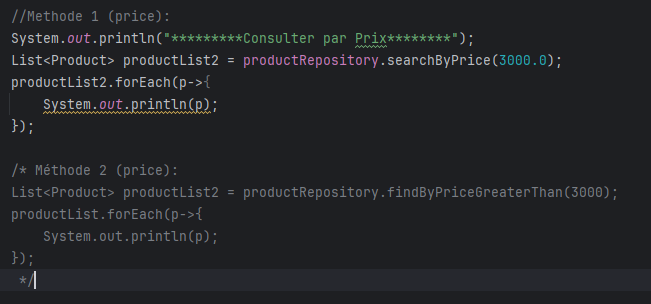
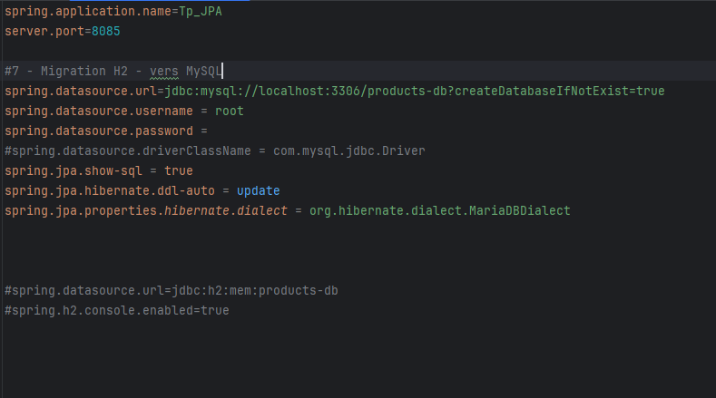

<h3>Compte Rendu TP2 </h3>

On considère le schéma suivant 

1. Création de l'entité JPA Produit

2. Configurer l'unité de persistance dans le ficher application.properties

3. Création de l'interface JPA Repository basée sur Spring data

4. l'Ajout des produits :

h2-console:

5. Consulter tous les produits

Resultat d'execution:

6. Consulter un produit by Id

Resultat d'execution:

7. Chercher des produits par nom :

Resultat d'execution:

7. Chercher des produits par prix :

Resultat d'execution:

8. Mettre à jour un produit dont l'ID=3

Resultat d'execution:

9. supprimer un produit

Resultat d'execution:

10. Migrer de H2 Database vers MySQL
    pom.xml

application.properties

